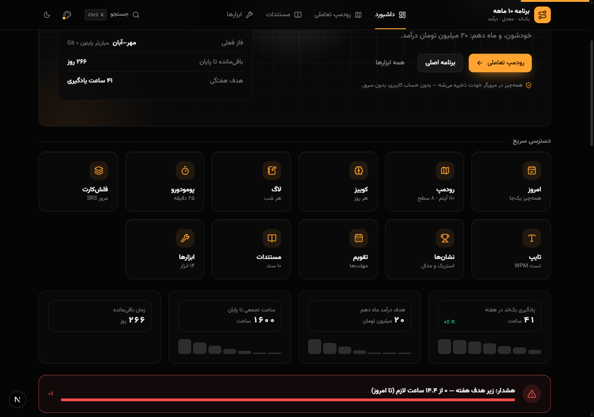
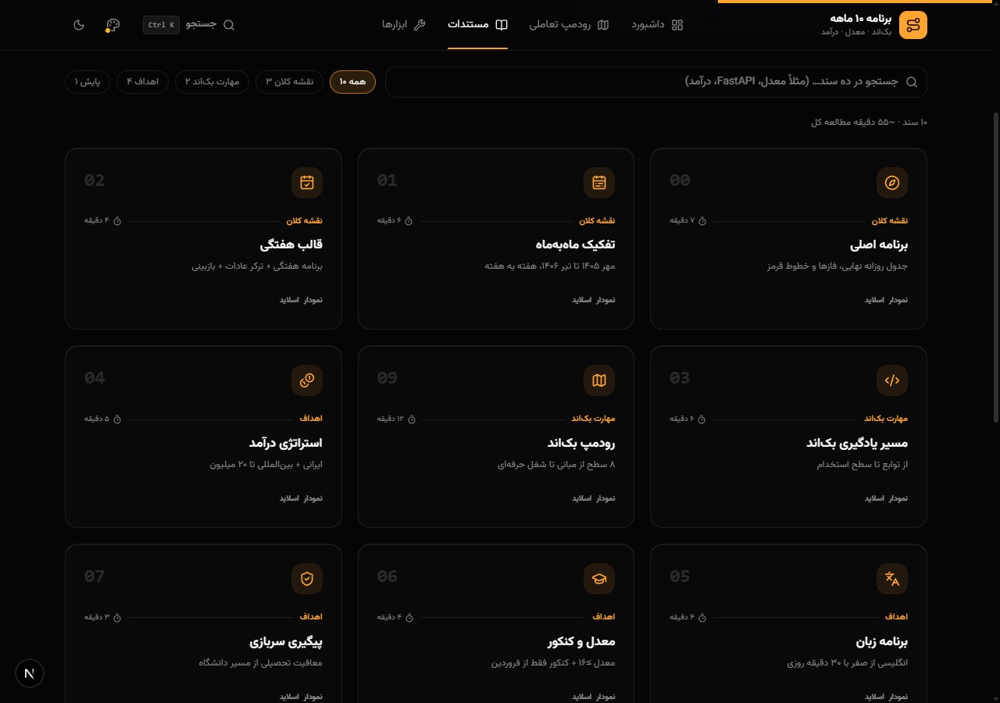
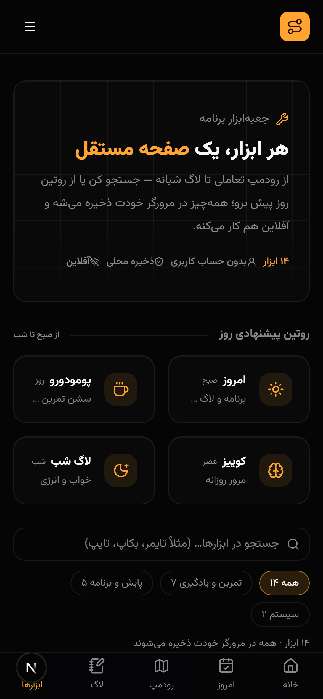

# برنامه ۱۰ ماهه — از دوازدهم تا درآمد

سایت شخصی برنامهٔ ۱۰ ماههٔ پوریا: ترکر روزانه، رودمپ ۱۱۰ آیتمی، مستندات کامل برنامه، تایمر پومودورو، فلش‌کارد SRS و بازی‌های تمرینی — همه‌چیز آفلاین‌محور با localStorage، بدون سرور و بدون حساب کاربری.

<p>
  
  
  
  
</p>

## ✨ امکانات

- **امروز** — چک‌لیست روز، ثبت سریع انرژی/روحیه، آمار و استریک
- **رودمپ** — ۱۱۰ آیتم در ۸ سطح با درصد پیشرفت و ذخیرهٔ محلی
- **مستندات** — ۱۰ سند برنامهٔ ۱۰ ماهه (فازها، ماه‌به‌ماه، بک‌اند، درآمد، زبان…) با جست‌وجوی فارسی
- **ابزارها** — پومودورو، تایپینگ، فلش‌کارد SRS، کوییز، چالش مصاحبه، تمرین لیکدکد، ماشین‌حساب ساب‌نت، داشبورد و تقویم
- **بازی‌ها** — مرور شبکه‌ها، بازسازی تایم‌لاین، مایند‌مپ، شبیه‌ساز ترمینال
- **PWA** — قابل نصب روی موبایل، سرویس‌ورکر با کش آفلاین، تم و `theme-color` زنده
- **تم و رنگ** — ۳ حالت (گرافیت / کاغذ / میدنایت) + ۵ پالت اکسنت، RTL کامل با فونت وزیرمتن و اعداد فارسی
- **ریسپانسیو** — داک پایین در موبایل، صفر سرریز در عرض ۳۶۰px در همهٔ مسیرها

## 📸 تصاویر

| خانه | مستندات |
|---|---|
|  |  |

| موبایل |
|---|
|  |

## 🚀 شروع سریع

```bash
npm install
npm run dev     # http://localhost:3000
```

دستورهای دیگر: `npm run build` · `npm run start` · `npm run lint` · `npx tsc --noEmit`

## 📁 ساختار پروژه

```
website/
├── content/                  # اسناد markdown برنامهٔ ۱۰ ماهه (محتوای مستندات)
├── screenshots/              # تصاویر README
├── public/
│   ├── icons/                # آیکون‌های PWA (192/512/maskable/apple)
│   ├── assets/plan/          # تصاویر نقشه‌ها و مایند‌مپ‌ها
│   └── sw.js                 # سرویس‌ورکر (کش آفلاین)
├── src/
│   ├── app/                  # مسیرهای App Router (۱۵ صفحه + API جست‌وجو)
│   ├── components/
│   │   ├── ui/               # پریمیتیوهای shadcn (button, card, tabs, …)
│   │   ├── layout/           # shell, navbar, footer, داک موبایل
│   │   ├── shared/           # تم، اکسنت، سرچ‌دیالوگ، نوتیف، چارت‌ها
│   │   ├── home/ docs/ tools/ today/ roadmap/ achievements/ pomodoro/
│   │   ├── animations/ backgrounds/ blocks/
│   │   └── ...
│   └── lib/
│       ├── data/             # داده‌های کوییز/لیکدکد/مصاحبه/فلش‌کارد/…
│       ├── content.ts        # خواندن markdown از content/
│       ├── store.ts          # localStorage store با SWR
│       ├── jalali.ts         # تقویم جلالی
│       └── utils.ts targets.ts pomo.ts streak.ts backup.ts use-mounted.ts
├── .github/workflows/ci.yml  # CI: lint + type-check + build
├── AGENTS.md                 # دستورالعمل‌های ایجنت‌ها
└── LICENSE                   # MIT
```

## 🗂 محتوا

اسناد برنامه در `content/*.md` زندگی می‌کنند و از همان‌جا توسط `src/lib/content.ts` خوانده می‌شوند؛ ویرایش یک فایل md بلافاصله در صفحهٔ `/docs/<SLUG>` بازتاب می‌شود.

## 📦 PWA

منیفست در `src/app/manifest.ts` (کنوانسیون رسمی Next)، سرویس‌ورکر در `public/sw.js`: پیش‌کش پوستهٔ ۷ مسیر اصلی، کش‌اول برای فایل‌های هش‌دار و شبکه‌اول برای صفحات با فالبک آفلاین.

---

© 2026 Pouria Pakzad — [MIT](LICENSE)
