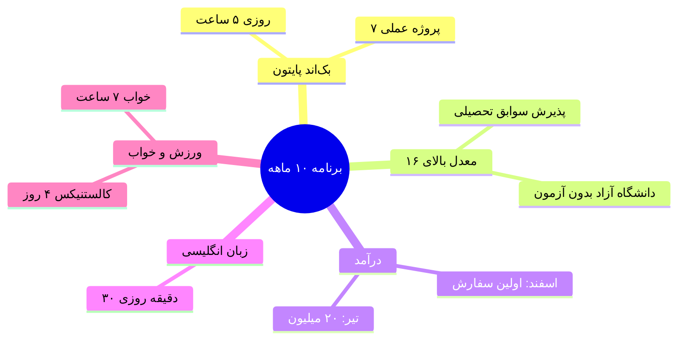
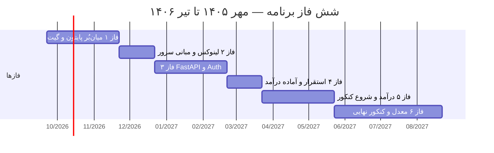

# برنامه جامع ۱۰ ماهه — از دوازدهم تا درآمد

**تاریخ شروع:** ۱ مهر ۱۴۰۵ (2026-09-23)  
**پایان:** تیر ۱۴۰۶ — کنکور + آماده‌سازی ورود دانشگاه

---

```slides
طرح در ۵ اسلاید — برنامه ۱۰ ماهه
- مهر ۱۴۰۵ تا تیر ۱۴۰۶ | پنج هدف هم‌زمان روی یک صفحه
- روز مدرسه: ۴.۷۵ ساعت بک‌اند | روز تعطیل: ۱۰ ساعت پای کامپیوتر
- خواب ۷ ساعت و موبایل ۲۰ دقیقه — غیرقابل مذاکره
---
هدف ۱: بک‌اند پایتون — روزی ~۵ ساعت، ۱۶۰۰ ساعت تجمعی
- هفته ۱ تا ۸: میان‌بُر OOP، گیت و دیتاسترکچر
- زمستان: FastAPI + دیتابیس + احراز هویت
- خروجی: ۷ پروژه در گیت‌هاب + پرتفولیوی آنلاین
---
هدف ۲: معدل بالای ۱۶ — پذیرش بدون کنکور
- ۶۰٪ نمره کنکور از سوابق تحصیلی است؛ یعنی قطعی
- امتحانات خرداد، سرنوشت‌سازترین روزهای برنامه‌اند
- روش: سه روز تمام‌وقت قبل از هر امتحان
---
هدف ۳: اولین درآمد — اسفند شروع، تیر ۲۰ میلیون
- آذر: نمونه‌کار حرفه‌ای + ثبت‌نام در پلتفرم‌ها
- اسفند: اولین سفارش کوچک (پروژه ۲–۵ میلیون)
- فروردین تا تیر: مشتری مستقیم + نگه‌داشت درآمد
---
اهداف ۴ و ۵: زبان ۳۰ دقیقه + ورزش ۴۵ دقیقه
- زبانِ تخصصی: مستندات، ویدیو و لغت‌های کد
- کالستنیکس در خانه، ۴ جلسه در هفته
- پنجشنبه‌ها: بازبینی ۳۰ دقیقه — بدون استثنا
```

## 🎯 اولویت‌ها (طبق گفته خودت)

| # | هدف | مسیر | بدون کنکور؟ |
|---|------|------|-------------|
| ۱ | دانشگاه بر اساس معدل | پذیرش سوابق تحصیلی (امتحانات نهایی دوازدهم) | ✅ بله |
| ۲ | دانشگاه آزاد | پذیرش با معدل/بدون آزمون (شهریه از درآمد کار) | ✅ بله |
| ۳ | کنکور | **فقط بعد از عید** — ۲ تا ۳ ساعت/روز | ❌ از مهر تا عید نه |
| ۴ | درآمد از ماه ۵–۶ | فریلنسری بین‌المللی + شغل ایرانی | هدف ماه ۱۰: **۲۰ میلیون/ماه** |
| ۵ | سربازی | معافیت تحصیلی از طریق دانشگاه | پیگیری اداری لازمه |

> **نکته طلایی:** تأثیر معدل در کنکور حدود **۶۰٪ قطعی** و سهم خود آزمون **۴۰٪**. یعنی امتحانات نهایی خرداد ۱۴۰۶ مهم‌ترین آزمون توئه — مدرسه هدررفت نیست، **۶۰٪ مسیر دانشگاهه.**

---



## ⏰ جدول زمانی روزانه (نهایی)

### روز مدرسه (شنبه–چهارشنبه | ۷:۰۰ تا ۱۴:۳۰)

| ساعت | فعالیت |
|------|--------|
| ۶:۰۰ | بیداری |
| ۷:۰۰ – ۱۴:۳۰ | **مدرسه** (تمرکز کامل در کلاس = سرمایه‌گذاری معدل) |
| ۱۴:۳۰ – ۱۵:۰۰ | ناهار + استراحت |
| ۱۵:۰۰ – ۱۷:۳۰ | **بک‌اند پایتون — سشن ۱** (۲.۵ ساعت) |
| ۱۷:۳۰ – ۱۸:۱۵ | **کالستنیکس** (۴۵ دقیقه) |
| ۱۸:۱۵ – ۱۹:۰۰ | شام + استراحت |
| ۱۹:۰۰ – ۲۱:۱۵ | **بک‌اند پایتون — سشن ۲** (۲.۲۵ ساعت) |
| ۲۱:۱۵ – ۲۱:۴۵ | **زبان انگلیسی** (۳۰ دقیقه) |
| ۲۱:۴۵ – ۲۲:۳۰ | مرور روز + برنامه فردا + `git commit` |
| ۲۳:۰۰ | خواب (۷ ساعت) |

**جمع بک‌اند روز مدرسه: ~۴.۷۵ ساعت**

### روز تعطیل (پنجشنبه / جمعه — ۱۰ ساعت پای کامپیوتر)

| ساعت | فعالیت |
|------|--------|
| ۹:۰۰ – ۱۲:۰۰ | سشن ۱ (۳h) |
| ۱۲:۰۰ – ۱۳:۳۰ | ناهار + استراحت |
| ۱۳:۳۰ – ۱۶:۳۰ | سشن ۲ (۳h) |
| ۱۶:۳۰ – ۱۷:۱۵ | ورزش |
| ۱۷:۱۵ – ۲۰:۱۵ | سشن ۳ (۳h) — نیم‌ساعت آخر زبان |
| ۲۰:۱۵ – ۲۱:۰۰ | شام + مرور (پنجشنبه: بازبینی هفتگی) |

**جمع بک‌اند روز تعطیل: ~۸.۵ ساعت**


### خلاصه هفتگی

| آیتم | ساعت/هفته |
|------|-----------|
| بک‌اند پایتون | **~۴۱ ساعت** |
| زبان انگلیسی | ۳.۵ ساعت |
| ورزش | ~۵ ساعت |
| مدرسه (سرمایه‌گذاری معدل) | ۳۵ ساعت |

**در ۱۰ ماه ≈ ۱۶۰۰+ ساعت یادگیری بک‌اند** — کافیه از سطح متوسط تا سطح استخدام برسی. ✅

---

## 📅 فازهای ۱۰ ماهه

| فاز | ماه‌ها | تمرکز | خروجی |
|-----|--------|-------|-------|
| **۱. میان‌بُر پایتون** | مهر–آبان | OOP، دیتاسترکچر، تست، Git | ۳ پروژه CLI روی GitHub |
| **۲. مبانی + لینوکس** | آذر | الگوریتم، لینوکس، VPS | اسکریپت مستقر روی سرور |
| **۳. بک‌اند وب** | دی–بهمن | FastAPI، PostgreSQL، Auth، تست | API با ۸۰٪ پوشش تست |
| **۴. استقرار + اولین درآمد** | اسفند | Docker، CI/CD، پرتفولیو، اولین پروپوزال | محصول مستقر + **اولین پول** |
| **۵. درآمد + شروع کنکور** | فروردین–اردیبهشت | فریلنسری + ۲–۳h کنکور روزی | ۵–۱۰ میلیون/ماه |
| **۶. امتحانات + کنکور** | خرداد–تیر | **معدل اول، کنکور دوم، کار سوم** | معدل ≥۱۶، کنکور، ۲۰ میلیون/ماه |

---



## 📁 ساختار پوشه

```
planning-10month/
├── 00-MASTER-PLAN.md          ← همین فایل
├── 01-MONTHLY-BREAKDOWN.md    ← جزئیات ماه به ماه
├── 02-WEEKLY-TEMPLATE.md      ← قالب هفتگی
├── 03-PYTHON-CURRICULUM.md    ← مسیر یادگیری بک‌اند
├── 04-INCOME-STRATEGY.md      ← مسیر درآمد (ایرانی + بین‌المللی)
├── 05-ENGLISH-PLAN.md         ← زبان از صفر با ۳۰ دقیقه روزی
├── 06-GPA-AND-KONKUR.md       ← استراتژی معدل + کنکور بعد از عید
├── 07-SARBAZI-TRACKER.md      ← معافیت تحصیلی از مسیر دانشگاه
└── 08-TRACKING-DASHBOARD.md   ← داشبورد پیگیری عادات و KPI
```

---

## ✅ اقدامات هفته اول (مهر)

- [ ] محیط توسعه: Python 3.11+, VS Code, Git, حساب GitHub
- [ ] ساخت پروژه اول: `python-cli-projects` روی GitHub
- [ ] ثبت‌نام پلتفرم‌های کاری: کارلنسر، پونیشا، Jobinja، LinkedIn
- [ ] ساخت حساب Anki برای زبان + شروع ۳۰ دقیقه روزی
- [ ] پیگیری اداری سربازی: استعلام وضعیت از نظام وظیفه
- [ ] ذخیره `02-WEEKLY-TEMPLATE.md` به‌عنوان `week-01.md` و پر کردن آن

---

## 🚨 خطوط قرمز

- موبایل **حداکثر ۲۰ دقیقه/روز** فقط کاری
- اینستاگرام و محتوای مضر حذف‌شده — **برنگردون**
- خواب **۷ ساعت غیرقابل مذاکره**
- **هر روز حداقل یک commit** حتی یک خط
- **بازبینی هفتگی پنجشنبه‌ها** — برنامه از داده اصلاح میشه، نه از حس

---

## 🚦 نقاط تصمیم

| زمان | چک‌پوینت | اگه عقب بودی |
|------|----------|---------------|
| پایان آذر | OOP + Git مسلط، ۳ پروژه | ۲ هفته اضافه از فاز ۱ |
| پایان بهمن | API تست‌شده مستقر | فاز ۴ رو ساده‌تر کن، پروژه کوچیک‌تر |
| پایان اسفند | اولین درآمد یا پروپوزال جدی | اول پروژه پورتفولیو، درآمد فروردین |
| پایان اردیبهشت | ۵–۱۰ میلیون/ماه | تمرکز ۱۰۰٪ ایرانی (کارلنسر/آژانس) |
| خرداد | معدل آزمون‌ها ≥۱۶ | کنکور و کار مکث، معدل اولویت اول |

---

*آخرین به‌روزرسانی: ۱ مهر ۱۴۰۵ — هر پنجشنبه در `08-TRACKING-DASHBOARD.md` آپدیت کن.*