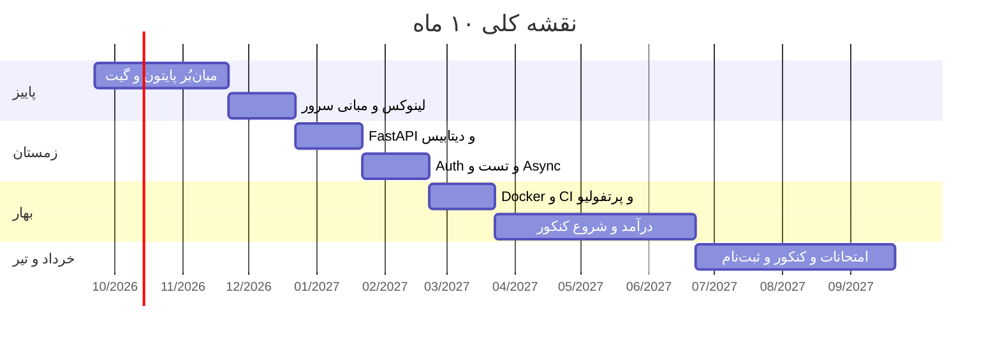

# تفکیک ماه‌به‌ماه — مهر ۱۴۰۵ تا تیر ۱۴۰۶

> از `00-MASTER-PLAN.md` مشتق شده. ساعت‌ها بر اساس روز مدرسه (۴.۷۵h) و روز تعطیل (۸.۵h).

---




## مهر ۱۴۰۵ — فاز ۱: میان‌بُر پایتون (هفته ۱–۴)

**تمرکز:** از «توابع تموم شده» تا OOP + دیتاسترکچر + Git

| هفته | یادگیری | خروجی | زبان | معدل |
|------|---------|-------|------|------|
| ۱ | دیتاسترکچر (list/dict/set) + comprehensions | اسکریپت سازمان‌دهنده فایل | درس ۱ | تمرکز کلاس |
| ۲ | OOP: کلاس، ارث، magic methods، dataclass | Todo CLI با ذخیره JSON | درس ۲ | تمرکز کلاس |
| ۳ | typing، ماژول‌ها، venv، pip، استایل کد (ruff) | بسته‌بندی پروژه + پاکسازی کد | درس ۳ | تمرکز کلاس |
| ۴ | pytest: تست نوشتن + TDD مقدماتی | همون پروژه تست‌شده ۸۰٪+ | درس ۴ | جمع‌بندی |

**خروجی مهر:** ۳ پروژه CLI روی GitHub با README و تست

---

```slides
الگوی تکرارشونده هر ماه — چهار قدم
- هدف ماه را از این فایل کپی کن داخل لاگ هفتگی
- هر هفته فقط یک بار برنامه را لمس کن، نه هر روز
- پنجشنبه آخر ماه: بازبینی ۶۰ دقیقه + تصمیم ماه بعد
---
خروجی ماه باید ملموس باشد
- مهر: سه فایل پایتون تمیز در گیت‌هاب با تست
- دی: API احراز هویت مستقر روی VPS با مستندات
- اسفند: اولین فاکتور و اولین بازخورد مشتری
---
نقطه کنترل سلامت برنامه
- اگر دو هفته متوالی زیر ۸۰٪ هدف بودی: حجم را نصف کن، کیفیت را نه
- اگر خواب از ۷ ساعت زد: اول خواب، بعد جبران
- اگر موبایل از ۲۰ دقیقه گذشت: فردا یک ساعت زودتر بیدار شو نه، استراحت کن
---
قانون طلایی ماه
- یادگیری بدون پروژه = صفر
- پروژه بدون مستندات = نصف
- مستندات بدون استقرار = آزمایشگاه، نه نمونه‌کار
```

## آبان ۱۴۰۵ — فاز ۱ ادامه: Git عمیق + ریاضیات کد

**تمرکز:** Git حرفه‌ای + الگوریتم‌های ساده

| هفته | یادگیری | خروجی |
|------|---------|-------|
| ۵ | Git: branch، merge، PR، conflict | همکاری روی یک repo باز |
| ۶ | انواع داده ساده: stack، queue، hash | شبیه‌ساز این ساختارها |
| ۷ | مرتب‌سازی (merge/quick) + Big-O | ویژوالایزر متنی مرتب‌سازی |
| ۸ | حل مسئله: ۲ سؤال LeetCode در روز | ۲۵+ مسئله حل‌شده |

**خروجی آبان:** پروفایل GitHub فعال + شروع عادت مسئله‌حل‌کردن

---

## آذر ۱۴۰۵ — فاز ۲: مبانی + لینوکس

**تمرکز:** بازگشتگی، لینوکس، سرور

| هفته | یادگیری | خروجی |
|------|---------|-------|
| ۹ | بازگشتگی + backtracking | حل‌کننده ماز |
| ۱۰ | لینوکس: فایل‌سیستم، مجوزها، پروسه‌ها | اسکریپت bash خودکارسازی |
| ۱۱ | SSH + خرید VPS ارزان + امن‌سازی | اسکریپت مستقر روی سرور واقعی |
| ۱۲ | درخت‌ها (BST) + جستجوی دودویی + مرور | ۵۰+ مسئله LeetCode جمع‌شده |

**خروجی آذر:** اپ/اسکریپت مستقر روی VPS + systemd

---

## دی ۱۴۰۵ — فاز ۳: بک‌اند وب (FastAPI)

**تمرکز:** HTTP + FastAPI + پایگاه‌داده

| هفته | یادگیری | خروجی |
|------|---------|-------|
| ۱۳ | HTTP/REST + FastAPI: routing + Pydantic | CRUD API حافظه‌ای |
| ۱۴ | SQL + نرمال‌سازی + PostgreSQL | همون API با DB واقعی |
| ۱۵ | SQLAlchemy 2.0 + روابط + Alembic | مهاجرت‌ها + مدل‌های تمیز |
| ۱۶ | مستندات API + error handling | مستندات Swagger کامل |

**اعتبارسنجی:** اینجا باید مستندات انگلیسی FastAPI رو بخونی — جلوی درس زبان حساب میشه.

---

## بهمن ۱۴۰۵ — فاز ۳ ادامه: Auth + تست + Async

| هفته | یادگیری | خروجی |
|------|---------|-------|
| ۱۷ | رمزگذاری رمز + JWT + نقش‌ها | API احراز هویت‌شده |
| ۱۸ | تست: fixtures، TestClient، پوشش ۸۰٪ | پروژه تست‌شده |
| ۱۹ | async/await + Celery مقدماتی + Redis کش | تسک پس‌زمینه |
| ۲۰ | الگوی Repository + لایه سرویس | بازآرایی پروژه تمیز |

**خروجی بهمن:** یک API کامل و استاندارد در پورتفولیو

---

## اسفند ۱۴۰۵ — فاز ۴: استقرار + آماده درآمد

| هفته | یادگیری | خروجی |
|------|---------|-------|
| ۲۱ | Docker + docker-compose (app+postgres+redis) | استقرار چندسرویسی |
| ۲۲ | Nginx + SSL + Gunicorn + GitHub Actions | CI/CD کامل |
| ۲۳ | پرتفولیو: README، کیس‌استادی، LinkedIn، ثبت پلتفرم‌ها | پروفایل حرفه‌ای آماده |
| ۲۴ | پروژه کوچیک سفارشی یا آماده‌سازی نمونه کار | **اولین پروپوزال/سفارش** |

**خروجی اسفند:** مستقر + آماده کار + پروپوزال ارسال‌شده  
**عید نوروز: ۳–۴ روز استراحت واقعی** ✅ (بعدش فاز ۵)

---

## فروردین ۱۴۰۶ — فاز ۵: درآمد + شروع کنکور

| آیتم | ساعت/روز | جزئیات |
|------|----------|--------|
| بک‌اند/کار | ~۵h | ارسال روزانه پروپوزال + تحویل سفارش |
| **کنکور (شروع)** | **۲–۳h** | ریاضی دوازدهم از پایه + فیزیک (مرور + تست) |
| زبان | ۰.۵h | ادامه روتین |
| ورزش | ۰.۷۵h | کالستنیکس |

**هدف فروردین:** اولین سفارش ایرانی + ۳ پروپوزال خارجی/روزانه

---

## اردیبهشت ۱۴۰۶ — فاز ۵ ادامه: فشار درآمد

| آیتم | جزئیات |
|------|--------|
| درآمد | هدف: **۵–۱۰ میلیون/ماه** — تمرکز ایرانی (کارلنسر/آژانس) + ادامه خارجی |
| کنکور | ۲–۳h: ریاضی + فیزیک + شیمی با تست‌های کنکور |
| پروژه | نگهداری پروژه‌های مستقر (۲h هفته‌ای) |

---

## خرداد ۱۴۰۶ — فاز ۶: **معدل اولویت اول**

| اولویت | ساعت | چرا |
|--------|------|-----|
| **۱. امتحانات نهایی** | شب امتحان + ۳ روز قبل هر امتحان | ۴۳٪ نمره کنکور + شرط معدل آزاد — **غیرقابل چشم‌پوشی** |
| ۲. کنکور | ۱.۵–۲h بین امتحانات | حفظ آمادگی فروردین |
| ۳. کار | ۲h روزی — فقط تحویل و نگه‌داشت | از دست ندادن درآمد |

**خروجی خرداد:** دیپلم با معدل ≥۱۶ + درآمد پابرجا

---

## تیر ۱۴۰۶ — فاز ۶ پایانی: کنکور + ثبت‌نام

| هفته | تمرکز |
|------|-------|
| ۱–۲ | **کنکور فشرده: ۵–۶h/روز** (ریاضی/فیزیک/شیمی + آزمون آزمایشی) |
| ۳ | **آزمون کنکور** + ثبت‌نام پذیرش سوابق تحصیلی/بدون آزمون آزاد |
| ۴ | اعلام نتایج اولیه + تثبیت درآمد ۲۰ میلیونی + برنامه مهر |

---

## 📊 خلاصه درآمد ماهانه

| ماه | درآمد تخمینی (میلیون تومان) |
|-----|------------------------------|
| مهر–دی | ۰ (پورتفولیو می‌سازی) |
| بهمن–اسفند | ۰–۲ (اولین سفارش) |
| فروردین | ۲–۵ |
| اردیبهشت | ۵–۱۰ |
| خرداد | ۸–۱۵ |
| **تیر (هدف)** | **۲۰** ✅ |

---

*پنجشنبه‌ها در `08-TRACKING-DASHBOARD.md` مقایسه واقعی/برنامه رو ثبت کن.*