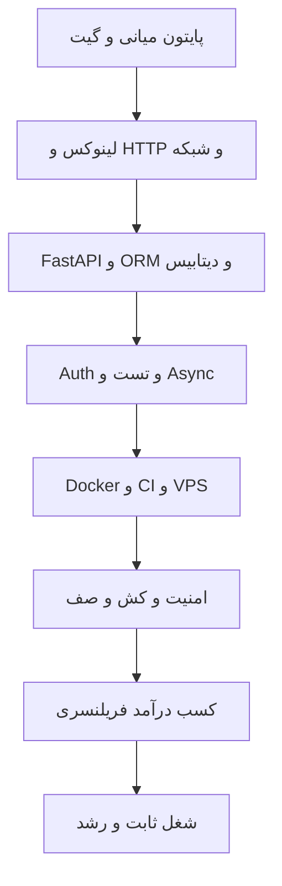

# مسیر یادگیری بک‌اند پایتون — ۱۰ ماهه

**سطح شروع:** توابع پایتون تموم شده ✅ (مهر ۱۴۰۵)  
**هدف:** بک‌اند کارآمده تا تیر ۱۴۰۶  
**ساعت: ~۴۱ ساعت/هفته** — هر مهارت → یک پروژه → یک خروجی مستقر  
**قاعده: کدنویسی بیشتر از تماشا (۷۰/۳۰) + هر روز یک commit**

---



## مهر–آبان: میان‌بُر پایتون (هفته ۱–۸)

```slides
نقشه ۱۰ ماهه بک‌اند در ۵ اسلاید
- هفته ۱ تا ۸: زبان را واقعاً یاد بگیر، نه فقط کتابخانه‌ها را
- هفته ۹ تا ۲۴: سه ضلع وب — سرور، دیتابیس، احراز هویت
- هفته ۲۵ تا ۴۰: استقرار، امنیت، پول درآوردن
---
قانون تسلط
- هر مفهوم = یک فایل کوچک در پروژه واقعی
- سه بار خواندن بهتر از سی بار کپی‌پیست است
- هر پروژه بدون تست و README ناتمام محسوب می‌شود
---
خطاهای رایج جونیورها
- کتابخانه را بلدی، ولی کد تمیز نمی‌نویسی
- سرور بالا می‌آید، ولی لاگ و خطا را نمی‌خوانی
- اول می‌نویسی، بعد فکر می‌کنی — برعکسش درست است
---
چک‌پوینت هر سطح
- بتوانی بدون گوگل، پروژه قبلی‌ات را از صفر بزنی
- بتوانی برای دوستت ساده توضیح بدهی
- بتوانی در مصاحبه چرایی انتخاب‌هایت را بگویی
```

### هفته ۱–۴: OOP و ابزار حرفه‌ای
- [ ] دیتاسترکچر: list, dict, set + comprehensions
- [ ] File I/O: JSON، CSV، خطاها (try/except)
- [ ] کلاس‌ها، ارث، ترکیب، magic methods، `@property`
- [ ] dataclass، enum، type hints
- [ ] ماژول‌ها، بسته، `venv`، `pip`، `requirements.txt`
- [ ] استایل کد: ruff/black، `logging`
- [ ] pytest: fixture، پوشش تست ۸۰٪+
- [ ] Git: commit، branch، merge، PR

**پروژه‌ها:** سازمان‌دهنده فایل + Todo CLI ذخیره‌شده در JSON + تست‌شده      

### هفته ۵–۸: دیتاسترکچر + مسئله‌حل‌کردن
- [ ] Big-O، مرتب‌سازی (bubble/selection/merge/quick)
- [ ] stack، queue، hash table، linked list (پیاده‌سازی دستی)
- [ ] بازگشتگی + backtracking 
- [ ] درخت: BST + traversal
- [ ] LeetCode Easy: **۲ سؤال در روز**
- [ ] Git پیشرفته: rebase، stash، resolve conflict

**پروژه‌ها:** ویژوالایزر مرتب‌سازی + حل‌کننده ماز  
**منابع:** Python Crash Course (بقیه فصل‌ها)، Corey Schafer (OOP + Git playlists)، LeetCode

---


## آذر: لینوکس + سرور (هفته ۹–۱۲)

- [ ] لینوکس: فایل‌سیستم، مجوزها، پروسه‌ها، pipeها، grep
- [ ] اسکریپت‌نویسی bash: متغیر، حلقه، شرط، cron
- [ ] SSH key + کپی فایل (`scp`/`rsync`)
- [ ] خرید VPS ارزان + امن‌سازی (fail2ban، ufw، کلید SSH)
- [ ] systemd: اجرای اپ پایتون به‌عنوان سرویس
- [ ] ادامه LeetCode (روزانه ۲)

**پروژه:** اسکریپت خودکارسازی (مثلاً بکاپ روزانه) مستقر روی VPS  
**منابع:** The Linux Command Line (PDF رایگان)، مستندات DigitalOcean

---

## دی: بک‌اند وب — FastAPI + دیتابیس (هفته ۱۳–۱۶)

- [ ] HTTP/REST: متدها، status codeها، هدرها
- [ ] FastAPI: routing، APIRouter، `Depends()`، Pydantic
- [ ] SQL: SELECT/JOIN/GROUP BY/ایندکس
- [ ] PostgreSQL: نصب، psql، نرمال‌سازی
- [ ] SQLAlchemy 2.0: مدل، رابطه، session
- [ ] Alembic: مهاجرت‌ها
- [ ] مستندات خودکار Swagger

**پروژه:** CRUD REST API (کاربران/آیتم‌ها) با DB واقعی  
**منابع:** مستندات رسمی FastAPI (کامل بخون — بهترین منبع) + SQLAlchemy docs

---

## بهمن: Auth + تست + Async (هفته ۱۷–۲۰)

- [ ] رمزگذاری bcrypt/argon2
- [ ] JWT: access/refresh، انقضا، RBAC
- [ ] محافظت از مسیرها + Depends
- [ ] pytest: TestClient، async test، mock — پوشش ۸۰٪+
- [ ] async/await + asyncio مقدماتی
- [ ] Celery مقدماتی + Redis (کش/صف)
- [ ] الگوی Repository + لایه سرویس

**پروژه:** API احرازهویت‌شده + تست‌شده → بازآرایی با معماری تمیز  
**منابع:** TDD with Python (O'Reilly)، Architecture Patterns with Python (رایگان)

---

## اسفند: استقرار + پرتفولیو (هفته ۲۱–۲۴)

- [ ] Docker: Dockerfile، لایه، volume، network
- [ ] docker-compose: app + postgres + redis + nginx
- [ ] Nginx: reverse proxy + SSL (Let's Encrypt)
- [ ] GitHub Actions: lint → test → build → deploy
- [ ] مدیریت env: `.env` + الگوی config
- [ ] لاگ‌گیری + healthcheck

**پروژه‌ها:** استقرار چندکانتینری + CI کامل  
**ساخت پرتفولیو:** README حرفه‌ای، ۳ کیس‌استادی، LinkedIn، ثبت در پلتفرم‌های کاری  
**منابع:** مستندات Docker + GitHub Actions + الگوی 12-Factor

---

## فروردین–اردیبهشت: تخصص + کسب درآمد (هفته ۲۵–۳۲)

### یادگیری (۲–۳h روزی، بقیه کار)
- [ ] پروفایل‌کردن: cProfile، Tracemalloc
- [ ] کش: الگوهای Redis، انفجار کش
- [ ] پرفورمنس DB: ایندکس، EXPLAIN، connection pool
- [ ] امنیت وب: OWASP Top 10، CORS، rate limit
- [ ] طراحی سیستم: مقیاس‌پذیری، load balancer، کش لایه‌ای
- [ ] صف پیام: RabbitMQ یا Redis Streams

### کار
- [ ] انتخاب niche: ربات تلگرام + پرداخت / بک‌اند فروشگاهی / اتوماسیون API
- [ ] ارسال پروپوزال روزانه
- [ ] تحویل + فاکتور + نظر مشتری

**پروژه:** تبدیل یکی از پروژه‌های پورتفولیو به محصول فروختنی یا سفارش واقعی

---

## خرداد–تیر: نگه‌داشت + کنکور (هفته ۳۳–۴۰)

- [ ] کار: تحویل و نگه‌داشت (۲–۴h روزی طبق برنامه معدل/کنکور)
- [ ] یادگیری: نگه‌داشتن — خوندن کد، آپدیت کتابخانه‌ها
- [ ] تمرکز اصلی: **امتحانات نهایی → کنکور**
- [ ] بعد از کنکور: تصمیم شغلی (فریلنسر تمام‌وقت یا شرکت)

---

## چک‌لیست مهارتی — آماده استخدام تا اردیبهشت

| مهارت | سطح لازم | وضعیت |
|-------|----------|--------|
| پایتون (۱۰+ پروژه) | قوی | ☐ |
| FastAPI | تولیدی | ☐ |
| PostgreSQL + SQL | مسلط | ☐ |
| Docker + Compose | روزمره | ☐ |
| CI/CD (GitHub Actions) | راه‌اندازی و نگهداری | ☐ |
| تست (pytest ۸۰٪+) | عادت | ☐ |
| Git + GitHub | روزمره | ☐ |
| لینوکس + VPS | راحت | ☐ |
| Async + Celery + Redis | کاربردی | ☐ |
| خواندن مستندات انگلیسی | روزانه | ☐ |
| مهارت مشتری (پروپوزال/مذاکره) | عملی | ☐ |

---

## منابع (یک‌جا ذخیره کن)

- **کتاب:** Python Crash Course • TDD with Python • Architecture Patterns with Python (رایگان)
- **دوره/ویدیو:** مستندات رسمی FastAPI • Corey Schafer • CS50 (MIT)
- **تمرین:** Roadmap.sh/backend • LeetCode • HackerRank
- **فارسی:** رفرنس‌های فارسی فقط وقتی گیر کردی — مستندات انگلیسی اولویت داره

---

## قوانین طلایی

1. **کد > تماشا.** حداکثر ۳۰٪ تماشا، ۷۰٪ تایپ.
2. **یک دوره در هر زمان.** انبار کردن دوره ممنوع.
3. **اول بساز، بعد یاد بگیر.** پروژه سریع‌تر از مستندات درس میده.
4. **همه‌چیز رو مستقر کن.** اگه آنلاین نیست، حساب نمیشه.
5. **commit روزانه — همیشگی.**

---

*بعدی: `04-INCOME-STRATEGY.md`*