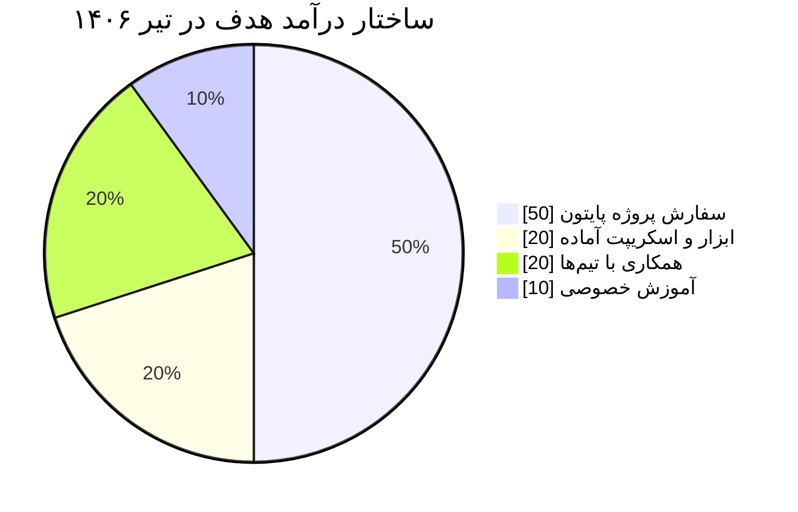

# استراتژی درآمد — ایرانی + بین‌المللی

**هدف:** از ماه ۵–۶ اولین درآمد → ماه ۱۰ (تیر ۱۴۰۶): **۲۰ میلیون تومان/ماه**

---

```slides
پلن پول — خلاصه اجرایی
- دو خط موازی: ایرانی (سریع) + بین‌المللی (رشد)
- تا آذر فقط ساختن؛ از دی بازاریابی شروع می‌شود
- هدف عددی: اسفند اولین فاکتور، تیر ۲۰ میلیون
---
قیمت‌گذاری شروع
- اسکریپت و ابزار کوچک: ۵۰۰ هزار تا ۲ میلیون
- وب‌سرویس کامل: ۵ تا ۱۵ میلیون
- پشتیبانی ماهانه: ۲۰ تا ۳۰ درصد مبلغ پروژه
---
قانون پیش‌پرداخت
- ۵۰٪ قبل شروع، ۵۰٪ تحویل — بدون استثنا
- دامنه کار را بنویس، امضا بگیر، بعد شروع کن
- تغییر جزء جدید = برآورد و پرداخت جدید
---
۳۰ دقیقه بازاریابی در روز
- یک نمونه‌کار به‌روز در گیت‌هاب
- یک پیام هدفمند به یک مشتری بالقوه
- یک نوشته کوتاه فنی که دیده شود
```

## 🗺️ نقشه دوخطی (هر دو با هم)

| مسیر | ارز | شروع | مزیت |
|------|-----|------|------|
| **ایرانی** (کارلنسر، پونیشا، آژانس‌ها، Jobinja) | تومان | **اسفند–فروردین** | سریع‌تر به پول می‌رسه، موانع کمتر |
| **بین‌المللی** (Upwork، مستقیم) | دلار | **فروردین+** | درآمد بالاتر، رزومه جهانی |

**ترکیب هدف ماه ۱۰:** ~۱۰ میلیون ایرانی + ~۱۰ میلیون بین‌المللی (یا هر ترکیبی که به ۲۰ برسه)

---

## 📅 تایم‌لاین درآمد

| ماه | اقدام | درآمد |
|-----|-------|-------|
| مهر–آبان | ساخت پروفایل: LinkedIn، GitHub، نمونه‌کار | ۰ |
| آذر–دی | ساخت نمونه‌کار حرفه‌ای + ثبت‌نام پلتفرم‌ها | ۰ |
| بهمن | **کارلنسر + پونیشا:** پروفایل کامل + ارسال ۳ سفارش | ۰ |
| اسفند | اولین سفارش ایرانی قبول کن (حتی ارزان برای نظر ۵ ستاره) | ۰–۲ م |
| فروردین | ایرانی: ۱–۲ پروژه فعال + شروع Upwork (پروفایل + ۵ پروپوزال/روز) | ۲–۵ م |
| اردیبهشت | بالا بردن نرخ + مشتری تکراری + Upwork اولین قرارداد | ۵–۱۰ م |
| خرداد | حفظ درآمد با ساعت کمتر (امتحانات) | ۸–۱۵ م |
| **تیر** | تثبیت | **۲۰ م** ✅ |

---

## 🇮🇷 مسیر ایرانی — سریع‌ترین راه به پول

**پلتفرم‌ها (اولویت‌بندی):**
1. **کارلنسر** (karlancer.com) — پروژه‌های برنامه‌نویسی
2. **پونیشا** (ponisha.ir) — فریلنسر فارسی‌زبان
3. **Jobinja / IranTalent** — شغل پاره‌وقت/دورکاری
4. **تلگرام:** گروه‌های استخدام برنامه‌نویسی + شبکه‌سازی با آژانس‌های دیجیتال محلی
5. **آژانس‌های وب ایرانی:** به‌عنوان زیرپیمانکار بک‌اند (پیوسته‌تر از پروژه‌های پراکنده)

**چه چیزی بفروشی (از ساده به پیچیده):**
- ربات تلگرام (پایتون، pyTelegramBotAPI) — تقاضای بالا، شروع آسان
- بک‌اند فروشگاه/پنل سفارش (FastAPI)
- اسکریپت اتوماسیون و خزش وب
- API سفارشی برای اپلیکیشن‌ها
- تعمیر/بهینه‌سازی کد موجود مشتری

**قیمت‌گذاری شروع:** ساعتی ۲۰۰–۴۰۰ هزار تومان یا پروژه‌ای توافقی — بعد از ۳ نظر مثبت +۵۰٪ اضافه کن.

**نمونه پروپوزال کوتاه:**

> سلام [اسم]،  
> [مشکل رو یک خط بازتاب بده — نشون بده فهمیدی].  
> من [X ماه] با پایتون/FastAPI [پروژه مشابه] ساختم — نمونه: [لینک].  
> می‌تونم [خروجی مشخص] رو تا [زمان] تحویل بدم. پیشنهاد: [مبلغ + مدت].  
> سوالی داشتید در خدمتم.

---

## 🌍 مسیر بین‌المللی — رشد بلندمدت

**Upwork (شروع فروردین):**
- پروفایل کامل: عنوان «Python Backend Developer (FastAPI)»
- نمونه‌کارهای مستقر با لینک زنده
- تست‌های Upwork (Python) رو بده — نشان اعتماد می‌سازه
- روزانه ۳–۵ پروپوزال هدفمند (پروژه‌های کوچک $50–200 برای شروع)
- بعد از ۳–۵ پروژه موفق: نرخ رو بالا ببر

**سایت‌ها:** Upwork • Fiverr ( gigs ثابت: «I will build a Python REST API») • مستقیم از طریق LinkedIn

**درون‌سپاری:** سایت‌های ایرانی‌ای که کار خارجی می‌گیرن — به‌عنوان نیروی بک‌اند

**دریافت ارز:** پی‌پال/پایونر یا هر روش قانونی موجود — قبلش تحقیق کن (ماه ۴)

---

## 📈 مسیر رشد تا ۲۰ میلیون

```
ماه ۵–۶:  اولین سفارش‌ها، نرخ پایه، جمع‌آوری نظر ⭐
ماه ۷:    مشتری تکراری + نرخ +۵۰٪ + شروع خارجی
ماه ۸:    دو مسیر موازی + سرویس ماهانه (retainer)
ماه ۹–۱۰: ثبات — ۲–۳ مشتری خوب به‌جای ۱۰ مشتری بد
```

**قوانین:**
- 💰 **پول اولیه = اعتمادبه‌نفس، نه ثروت** — حتی مبلغ کم نظر مثبت جمع کن
- 📦 **هر پروژه = کیس‌استادی** (مشکل → راه‌حل → نتیجه) برای پرتفولیو
- ⭐ **از هر مشتری راضی نظر بخواه**
- 📅 **در خرداد کار رو فشرده نکن** — معدل اول، کار نگه‌داشتن

---




## ⚠️ ریسک‌ها

| ریسک | واکنش |
|------|-------|
| اسفند سفارشی نیومد | رایگان یا ارزان ۱–۲ پروژه به آشنا + ربات تلگرامی بساز و بفروش |
| Upwork پروپوزال رد می‌کنه | اول Fiverr + مستقیم لینکدین؛ تا ۵۰ پروپوزال صبر کن |
| مشتری بد/بدپرداخت | پیش‌پرداخت ۵۰٪ + قرارداد کوتاه مکتوب |
| خرداد درآمد می‌خوابه | یک retainer ماهانه کوچیک از قبل ببند |

---

*هر پنجشنبه آمار واقعی رو در `08-TRACKING-DASHBOARD.md` ثبت کن.*