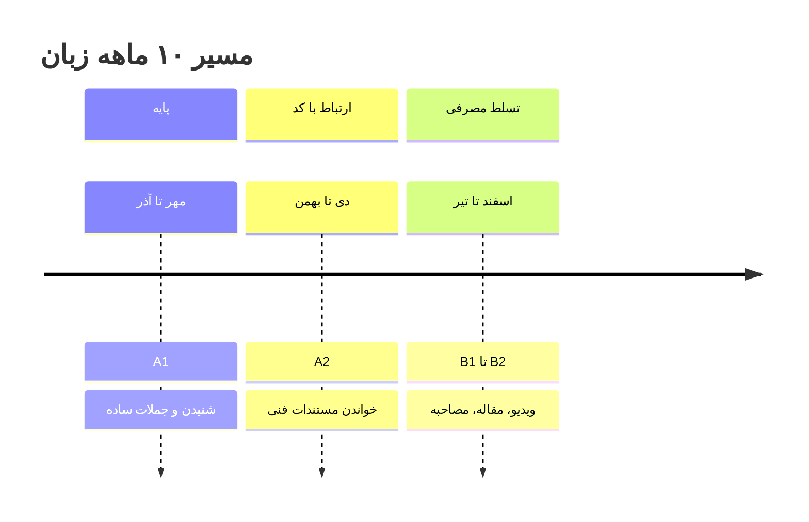

# برنامه زبان انگلیسی — از صفر، ۳۰ دقیقه روزی

**سطح فعلی:** صفر/ضعیف (مهر ۱۴۰۵)  
**زمان:** ۳۰ دقیقه روزهای مدرسه + نیم‌ساعت آخر سشن ۳ روزهای تعطیل = **~۳.۵ ساعت/هفته**  
**هدف ماه ۱۰:** خوندن مستندات فنی انگلیسی بدون ترجمه + فهم تدریس‌های یوتیوب با زیرنویس

---


## 🔑 اصل مهم: انگلیسی تو تخصصی یاد می‌گیری

تو برنامه‌نویسی هستی، پس **انگلیسیِ تو = انگلیسی مستندات، ارورها و ویدیوها.** عمومیِ محض وقت‌کشیه. کل واژگان و مثال‌ها از دنیای کد میاد.

---

```slides
روتین ۳۰ دقیقه زبان — هر روز
- ۱۰ دقیقه: شنیدن (پادکست فنی سطح پایه، یک بار دوباره)
- ۱۰ دقیقه: لغت‌های همان جلسه با جمله مثال
- ۱۰ دقیقه: خواندن یک بخش از مستندات کد انگلیسی
---
چرا تخصصی جواب می‌دهد
- همان کلمه را همان روز در کد می‌بینی → حافظه بلندمدت
- لیست لغت بی‌ربط حفظ نکن؛ فقط لغتی که این هفته دیدی
- ترجمه ذهنی را کنار بگذار، با انگلیسی فکر کن
---
چک‌پوینت ماهانه
- ماه ۳: یک ویدیوی ۵ دقیقه‌ای را با ۷۰٪ فهم ببین
- ماه ۶: یک مستندات انگلیسی را بدون دیکشنری بخوان
- ماه ۹: در یک مصاحبه کوتاه انگلیسی جواب بده
---
چه چیزی ممنوع
- اپ‌های بازی‌محور به‌جای تمرین جدی
- حفظ کردن لیست بدون مثال و بدون استفاده
- ترجمه خط‌به‌خط متن‌های طولانی
```

## فاز ۱: پایه (مهر–آذر، ۳ ماه)

| آیتم | روش | روزانه |
|------|-----|--------|
| **حافظه کارت (Anki)** | اولین ۵۰۰ کلمه پرکاربرد انگلیسی + کلمات کد | ۱۰ دقیقه (صبح یا انتظار) |
| **گرامر مینیمال** | فقط ساختار جمله: فاعل-فعل-مفعول، زمان‌ها | ۱۰ دقیقه (یک درس کوتاه) |
| **گوش دادن** | podcasts ساده (ESL Pod / BBC 6 Minute English) موقع ورزش | ۱۰ دقیقه |

- منابع: Duolingo (روزانه، عادت رو نشکن) • BBC Learning English • Anki
- **خروجی ماه ۳:** بتونی جمله ساده بنویسی و ۸۰٪ متون کوتاه رو بفهمی

## فاز ۲: ارتباط با کد (دی–بهمن، ۲ ماه)

| آیتم | روش | روزانه |
|------|-----|--------|
| Anki | ادامه + کلمات فنی (request, response, migration...) | ۱۰ دقیقه |
| **خوندن انگلیسی** | مستندات FastAPI و ارورهای Python رو **انگلیسی** بخون؛ فارسی ممنوع | ۱۰ دقیقه |
| **ویدیو انگلیسی** | Corey Schafer با زیرنویس انگلیسی (نه فارسی) | ۱۰ دقیقه |

- **خروجی ماه ۵:** مستندات رو با دیکشنری بخونی، ویدیو رو با زیرنویس انگلیسی بفهمی

## فاز ۳: تسلط مصرفی (اسفند–تیر)

| آیتم | روش |
|------|-----|
| مستندات | بدون دیکشنری تا حد ممکن؛ گوگل ترنسلیت فقط برای ۱–۲ کلمه در صفحه |
| ویدیو | زیرنویس انگلیسی، گاهی بدون زیرنویس |
| نوشتن | README ها و کیس‌استادی‌هات رو انگلیسی بنویس (تمرین نوشتن + پرتفولیو) |
| پروپوزال | پروپوزال Upwork انگلیسی — بازخورد مشتری واقعیه |

- **خروجی ماه ۱۰:** خواندن روانِ فنی + نوشتن انگلیسی کاری + درک ویدیو

---

## 📋 روتین روزانه ۳۰ دقیقه (روز مدرسه)

```
۱۰ دقیقه — Anki (کارت‌های دیروز + جدید)
۱۰ دقیقه — گرامر: یک درس کوتاه + ۵ جمله مثال
۱۰ دقیقه — گوش دادن (می‌تونه موقع کالستنیکس باشه)
```

---



## ❌ چیکار نکن

- کلاس/دوره گران نخر — منابع رایگان کافیه
- گرامر رو حفظ نکن، **کاربردی** یاد بگیر
- ترجمه کلمه‌به‌کلمه نکن؛ اول سعی کن از متن بفهمی
- از ۲ منبع بیشتر هم‌زمان استفاده نکن

---

## ✅ چک‌پوینت‌ها

| زمان | معیار |
|------|-------|
| پایان آذر | ۱۰۰۰ کلمه در Anki + فهم جمله ساده |
| پایان بهمن | خوندن مستندات با دیکشنری + ویدیو با زیرنویس انگلیسی |
| پایان اردیبهشت | نوشتن README انگلیسی بدون ابزار کمکی |
| تیر | پروپوزال و کیس‌استادی انگلیسی آماده ارسال |

---

*ترکر روزانه در `02-WEEKLY-TEMPLATE.md` — عادت «زبان ۳۰ دقیقه»*.