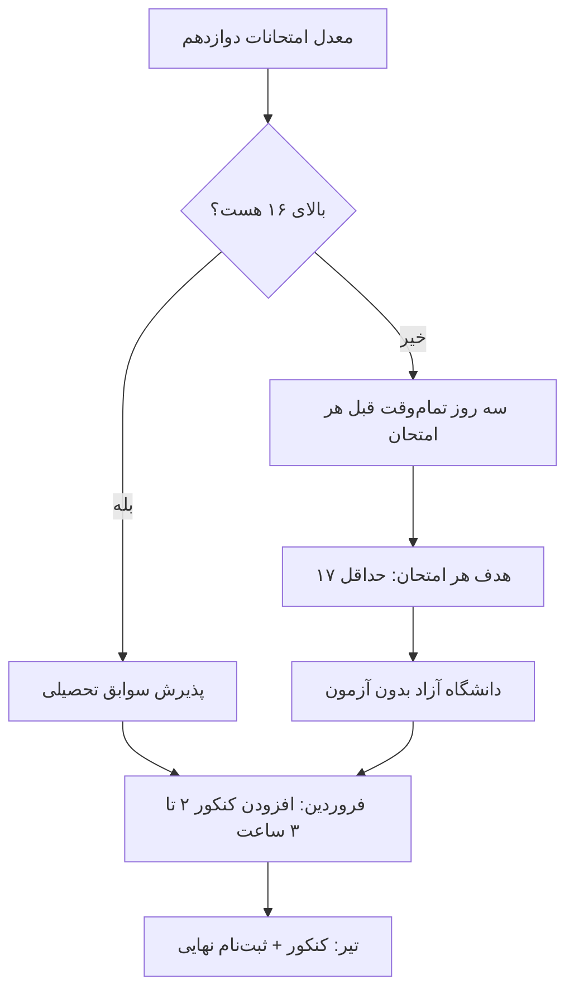

# استراتژی معدل + کنکور

---

## 📚 بخش اول: معدل (اولویت ۱ و ۲ — بدون کنکور)

### چرا معدل همه‌چیزه

| مسیر دانشگاه | معیار | بدون کنکور؟ |
|---------------|-------|-------------|
| **پذیرش بر اساس سوابق تحصیلی** (اولویت ۱) | معدل امتحانات نهایی دوازدهم | ✅ |
| **دانشگاه آزاد بدون آزمون** (اولویت ۲) | معدل کتبی/کل دیپلم — رقابت بین متقاضیان | ✅ |
| کنکور سراسری (اولویت ۳) | **۶۰٪ معدل (قطعی) + ۴۰٪ آزمون** | فقط بعد از عید |

> **نتیجه:** نمرات امتحانات نهایی دوازدهم هم پذیرش بدون کنکور رو می‌سازن هم ۶۰٪ کنکور رو. **یک بار درس خوندن، دو بار جواب میده.**

```slides
قانون معدل در ۴ اسلاید
- اولویت ۱: پذیرش سوابق تحصیلی — فقط معدل دوازدهم، بدون کنکور
- اولویت ۲: دانشگاه آزاد بدون آزمون — معدل کل دیپلم
- اولویت ۳: کنکور — فقط از فروردین، روزی ۲ تا ۳ ساعت
---
عدد هدف
- معدل کل دیپلم: حداقل ۱۶ برای رشته کامپیوتر آزاد
- هر امتحان کلاسی: حداقل ۱۷
- امتحانات خرداد: هر شب یک درس، سه روز قبل تمام‌وقت
---
روش مطالعه برای نمره
- تست‌های سال‌های قبل + شبیه‌سازی شرایط امتحان
- خلاصه‌نویسی یک‌صفحه‌ای هر درس در روز آخر
- شب امتحان فقط مرور خلاصه، مطلب نو یاد نگیر
---
بعد از عید
- فروردین: شروع رسمی کنکور، ۲–۳ ساعت روزی
- خرداد تا تیر: مرور آزمون آزمایشی + جمع‌بندی
- نتیجه: اگر معدل قوی باشد، فشار کنکور نصف می‌شود
```

### هدف عددی

| شاخص | هدف |
|------|-----|
| معدل کل دیپلم | **≥ ۱۶** (برای ریاضی/کامپیوتر آزاد رقابتیه) |
| هر امتحان کلاسی | ≥ ۱۷ |
| امتحانات نهایی خرداد | **≥ ۱۶ با تمرکز روی دروس تخصصی** |


### روش (بدون اضافه‌کاری بیهوده)

**۱. در کلاس حاضر و بیدار باش (رایگان‌ترین راه معدل):**
- ۸ ساعت مدرسه = ۸ ساعت سرمایه‌گذاری — فقط اگه **تو کلاس** باشی نه فکر جای دیگه
- سؤال بپرس، تکلیف رو همون روز حل کن

**۲. قبل از هر امتحان میان‌ترم (۲–۳ شب):**
- فقط نکات و سؤالات امتحانات سال‌های قبل + کتاب درسی
- هیچ منبع اضافه‌ای نخر

**۳. خرداد (امتحانات نهایی) — سنگین‌ترین بخش:**
- ۳ روز قبل از هر امتحان = تمام‌وقت اون درس
- اولویت: **دروس تخصصی رشته (ریاضی، فیزیک، الکتروتکنیک، نرم‌افزار)** چون نمره کتبی بالاتر در رشته‌های پرتقاضا تعیین‌کننده‌ست
- آرشیو نمونه امتحانات نهایی سال‌های قبل (سایت اداره آموزش‌وپرورش + گروه‌ها)

**۴. برای پذیرش سوابق تحصیلی:**
- ثبت‌نام در سایت سنجش + دریافت کد سوابق تحصیلی (dipcode) — **مهر تا بهمن پیگیری کن** نه خرداد
- مهلت‌ها رو در تقویم ثبت کن

---



## 📝 بخش دوم: کنکور (فقط بعد از عید)

### قانون کلی

| بازه | وضعیت کنکور |
|------|-------------|
| مهر – اسفند | **صفر ساعت.** صفر. نه کتاب بخر، نه استرسش رو تحمل کن |
| فروردین | **شروع: ۲–۳ ساعت/روز** |
| اردیبهشت | ۲–۳ ساعت/روز |
| خرداد | ۱.۵–۲ ساعت/روز بین امتحانات |
| تیر (۲ هفته آخر) | **فشرده: ۵–۶ ساعت/روز** |

### برنامه فروردین تا تیر

**فاز ۱ — فروردین: پایه‌ریزی**
- ریاضی دوازدهم: از فصل ۱ با حل تمرین کتاب — ۳ فصل در ماه
- فیزیک: مرور خلاصه‌نویسی‌های یازدهم+دوازدهم
- منبع: کتاب درسی + «کلید ریاضی/فیزیک» (یک منبع تست)

**فاز ۲ — اردیبهشت: تست‌زنی**
- ریاضی: ادامه + تست‌های کنکور سال‌های قبل
- فیزیک: تست‌زنی
- شیمی: مرور + تست
- **آزمون آزمایشی ماهانه ۱ عدد** (آزمون یا گاج — برای عادت به فضای کنکور)

**فاز ۳ — خرداد: نگه‌داشتن**
- فقط مرور سریع + حل ۲۰ تست در هفته
- اولویت با امتحانات نهایی

**فاز ۴ — تیر: فشرده**
- هفته ۱–۲: آزمون‌های شبیه‌سازی‌شده هر ۲ روز + تحلیل خطا
- هفته ۳: **کنکور**
- بعدش: فراغت از تحصیل، تمرکز ۱۰۰٪ درآمد

### نکته مهم
با معدل بالای ۱۶، سهم ۴۰٪ی آزمون فشار کمتری داره — **معدل بالا + کنکور متوسط = نتیجه خوب.** هدف واقع‌بینانه: رشته خوب دانشگاه آزاد یا پذیرش سوابق تحصیلی، نه سهمیه رایگان سراسری (مگر اینکه تیر غافلگیرکننده بشه).

---

## 📅 چک‌پوینت‌های تقویمی

| تاریخ | اقدام |
|-------|-------|
| آبان | ثبت‌نام کنکور (سنجش) — برای حفظ مسیر اولویت ۳ |
| آذر–بهمن | دریافت کد سوابق تحصیلی (dipcode) |
| فروردین ۱۴۰۶ | شروع رسمی کنکور |
| خرداد ۱۴۰۶ | امتحانات نهایی ← معدل |
| تیر ۱۴۰۶ | کنکور |
| شهریور ۱۴۰۶ | انتخاب رشته سوابق تحصیلی/بدون آزمون آزاد |

---

*جزئیات هفتگی کنکور از فروردین در `02-WEEKLY-TEMPLATE.md` (سطر «کنکور») پر میشه.*