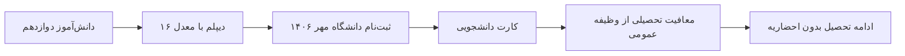

# ترکر سربازی — معافیت تحصیلی از مسیر دانشگاه

**مسیر انتخابی:** دانشگاه → معافیت تحصیلی  
**منطق:** دانشجوی دانشگاه (آزاد یا سراسری) تا پایان تحصیل از خدمت معاف/موکوله.

---

## 📌 مسیر

```
دیپلم (خرداد ۱۴۰۶)
   ↓
ثبت‌نام دانشگاه (مهر ۱۴۰۶) ← پذیرش سوابق تحصیلی یا آزاد
   ↓
دریافت معافیت تحصیلی از نظام وظیفه (با معرفی‌نامه دانشگاه)
   ↓
ادامه تحصیل = ادامه معافیت
```


## ⚠️ گلوگاه‌ها (قبلش تحقیق کن)

1. **بازه خرداد تا مهر ۱۴۰۶:** بین دیپلم و ثبت‌نام دانشگاه — اگه برگ احضار قبل از ثبت‌نام برسه چی؟ (معمولاً نه، ولی **استعلام وضعیت بده** تا مطمئن شی)
2. **مدت معافیت تحصیلی** معمولاً با شرط معدل/میانگین تمدید میشه — میانگین رو پایین نیار
3. قوانین هر سال تغییر می‌کنه — **حتماً از مرجع رسمی استعلام بگیر، نه از اینترنت و نه از دوست**

---

```slides
معافیت تحصیلی در ۴ اسلاید
- مسیر: دیپلم ← ثبت‌نام دانشگاه ← کارت دانشجویی ← معافیت
- نیاز اصلی: قبولی در دانشگاه تا مهر ۱۴۰۶
- سرعت: ثبت‌نام دانشگاه را عقب نینداز، احضاریه را نادیده نگیر
---
گلوگاه‌های واقعی
- فاصله خرداد تا مهر: اگر احضاریه آمد چه کنی؟ — استعلام بگیر
- معدل پایین = پذیرش سخت‌تر ← پیوند مستقیم با برنامه معدل
- اطلاعات ناقص: هر مرحله را از منبع رسمی چک کن
---
چک‌لیست کوتاه
- زمستان: استعلام وضعیت نظام وظیفه
- بهار: انتخاب رشته و ثبت‌نام دانشگاه
- تیر: دریافت دیپلم | مهر: ثبت‌نام نهایی
---
قانون ایمنی
- هیچ‌وقت غیبت و عدم‌حضور را تحمل نکن؛ همیشه مکتوب استعلام بگیر
- همه مدارک را دو نسخه نگه دار: کاغذی و ابری
- این صفحه را هر ماه یک بار باز کن و تیک بزن
```

## ✅ چک‌لیست اقدامات

| # | اقدام | مهلت | وضعیت |
|---|-------|------|-------|
| ۱ | **استعلام وضعیت وظیفه** — سامانه میزان (mojavesht) یا دفتر پلیس +۱۰ | مهر ۱۴۰۵ | ☐ |
| ۲ | بررسی دقیق شرایط معافیت تحصیلی از **سایت رسمی سازمان وظیفه عمومی** | مهر ۱۴۰۵ | ☐ |
| ۳ | پرسش از مشاور دفتر وظیفه: بازه دیپلم تا دانشگاه مشکلی داره؟ | دی ۱۴۰۵ | ☐ |
| ۴ | مدارک شناسایی/معاینه پزشکی (اگه مسیر معاینه پزشکی هم مد نظره) | اسفند ۱۴۰۵ | ☐ |
| ۵ | ثبت‌نام کنکور/پذیرش سوابق تحصیلی (حفظ مسیر دانشگاه) | بهار ۱۴۰۶ | ☐ |
| ۶ | دریافت دیپلم | خرداد ۱۴۰۶ | ☐ |
| ۷ | ثبت‌نام دانشگاه | مهر ۱۴۰۶ | ☐ |
| ۸ | دریافت معرفی‌نامه + ثبت درخواست معافیت تحصیلی | مهر ۱۴۰۶ | ☐ |
| ۹ | تأیید و دریافت کارت/وضعیت «معافیت تحصیلی» | مهر–آبان ۱۴۰۶ | ☐ |

---



## 📝 لاگ

| تاریخ | اقدام | نتیجه |
|-------|-------|-------|
| | | |
| | | |

---

## 💡 یادداشت

- **اگه دانشگاه قبول نشدی:** برنامه جایگزین لازمه (کسری خدمت / خدمت عمومی) — به همین دلیل معدل + کنکور اولویت‌های جدی‌ان
- **نکته درآمد:** دانشجو بودن + درآمد فریلنسری با هم منافاتی نداره
- منبع معتبر: **sakhteman.vazifeh.ir** (سازمان وظیفه عمومی) + دفتر وظیفه محل سکونت

---

*پس از هر مراجعه، لاگ بالا رو پر کن.*