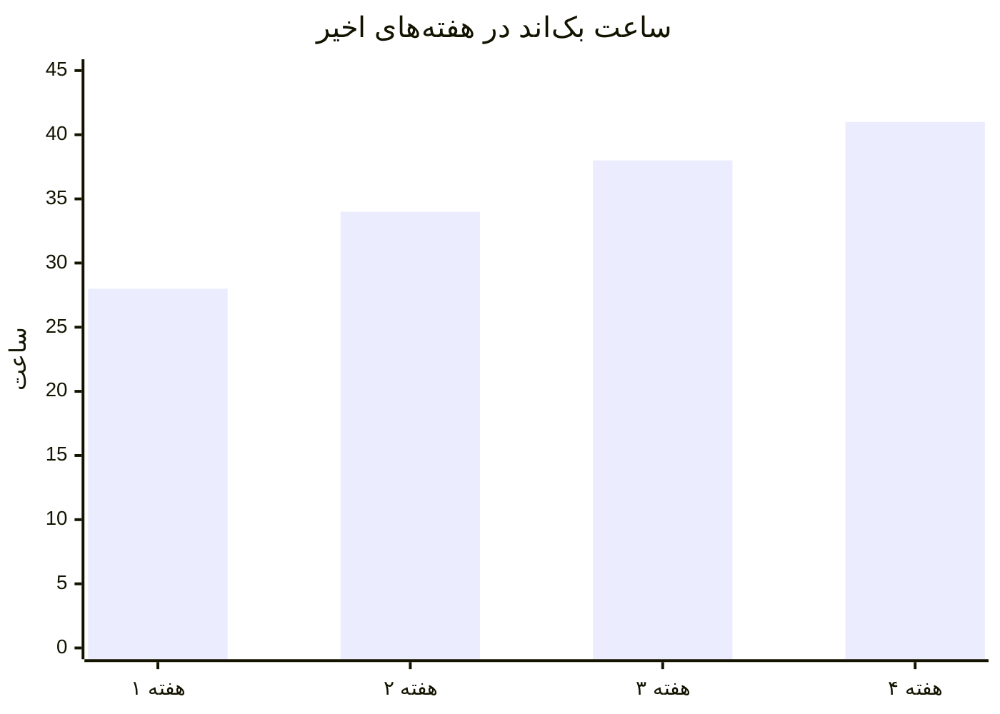

# داشبورد پیگیری

**هر پنجشنبه ۳۰ دقیقه:** آمار هفته رو پر کن → اگه هدف خورده شد، علت رو بنویس → هفته بعد رو اصلاح کن.

---

## 📆 هدف بزرگ — وضعیت لحظه‌ای

| شاخص | هدف نهایی | الان | تا هدف |
|------|-----------|------|--------|
| درآمد ماهانه (میلیون تومان) | ۲۰ (تیر ۱۴۰۶) | ۰ | ۲۰ |
| معدل دیپلم | ≥ ۱۶ | — | — |
| پروژه‌های مستقر در پورتفولیو | ۳–۵ | ۰ | |
| مهارت انگلیسی | خواندن فنی روان | صفر | |
| وضعیت سربازی | معافیت تحصیلی | استعلام‌نشده | |
| ساعت بک‌اند تجمعی | ~۱۶۰۰h | ۰h | |

---


## 📊 لاگ هفتگی

> هر ردیف = یک هفته. از مهر شروع کن.

| هفته | تاریخ | ساعت بک‌اند (هدف ۴۱) | LeetCode | زبان (×۷) | ورزش (×۷) | commit (×۷) | ساعت کنکور | درآمد (م) | معدل آزمون | روحیه ۱-۱۰ |
|------|-------|----------------------|----------|-----------|------------|-------------|------------|-----------|-------------|-------------|
| ۱ | | | | | | | ۰ | ۰ | | |
| ۲ | | | | | | | ۰ | ۰ | | |
| ۳ | | | | | | | ۰ | ۰ | | |
| ۴ | | | | | | | ۰ | ۰ | | |

*(ردیف‌های بعدی رو هر هفته اضافه کن)*

---

```slides
لاگ هفتگی در ۳۰ ثانیه — پنجشنبه شب
- ساعت بک‌اند هفته ← عدد واقعی، نه «حدوداً»
- LeetCode حل‌شده + زبان + ورزش + commit ها
- روحیه ۱ تا ۱۰ و یک جمله درباره هفته
---
چه بخوانی
- روند چهار هفته اخیر مهم‌تر از عدد این هفته است
- دو هفته پشت‌سرهم زیر هدف = هشدار قرمز
- یک هفته قرمز = استراحت جبرانی، نه جمع‌بندی پروژه‌ای
---
چک‌پوینت ماهانه
- درآمد ماه: صفر، شروع یا رشد؟ مقایسه با مسیر
- معدل آزمون‌ها: بالای ۱۶ هست یا نه
- پروژه جدید: ماهی یکی، مستقر و مستندشده
---
پاداش رفتاری
- چهار هفته سبز متوالی: یک روز تعطیلی کامل، بدون احساس گناه
- رسیدن به هدف ماه: یک چیز کوچک بخر برای میز کارت
- هر ۱۰۰ ساعت ثبت‌شده: این عدد را جایی بنویس، دیدنش انگیزه است
```

## ✅ ترکر روزانه (یک هفته = یک جدول کپی‌شده از `02-WEEKLY-TEMPLATE.md`)

عادت‌های غیرقابل مذاکره:

- [ ] موبایل ≤ ۲۰ دقیقه
- [ ] بدون اینستاگرام
- [ ] خواب ۷ ساعت
- [ ] ورزش
- [ ] زبان ۳۰ دقیقه
- [ ] git commit
- [ ] تمرکز در کلاس

---



## 🚦 چک‌پوینت‌های ماهانه (پنجشنبه آخر ماه)

| ماه | سؤال | آره/نه |
|-----|-------|--------|
| پایان مهر | ۳ پروژه CLI روی GitHub؟ OOP مسلط؟ | |
| پایان آبان | Git روان؟ ۲۵ مسئله حل‌شده؟ | |
| پایان آذر | اسکریپت روی VPS مستقر؟ ۵۰ مسئله؟ | |
| پایان دی | CRUD API با PostgreSQL؟ | |
| پایان بهمن | API احرازهویت‌شده با ۸۰٪ تست؟ | |
| پایان اسفند | CI/CD + پرتفولیو + اولین پروپوزال؟ | |
| پایان فروردین | اولین سفارش/درآمد؟ کنکور ۲h شروع شد؟ | |
| پایان اردیبهشت | ۵–۱۰ میلیون/ماه؟ معدل کلاسی ≥۱۷؟ | |
| پایان خرداد | معدل امتحانات ≥۱۶؟ درآمد سر پا؟ | |
| پایان تیر | کنکور دادی؟ معافیت تحصیلی در جریان؟ **۲۰ میلیون؟** | |

---

## 🧠 بازبینی ماهانه (پنجشنبه آخر — ۱ ساعت)

**۱. بهترین اتفاق ماه:**
- 

**۲. بدترین هدررفت ماه:**
- 

**۳. عدد واقعی vs هدف:**
- ساعت بک‌اند: 
- درآمد: 
- معدل: 

**۴. تصمیم ماه بعد:**
- 

---

*این فایل، تنها فایلیه که هر هفته آپدیتش می‌کنی. بقیه ماهانه.*