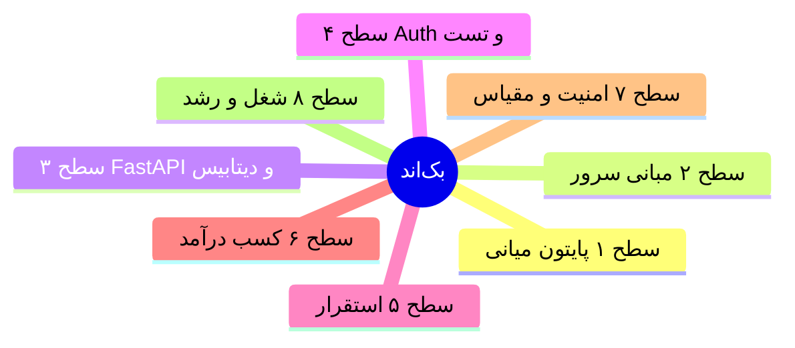

# رودمپ جامع بک‌اند — از مبانی تا شغل حرفه‌ای

**مسیر تو:** توابع پایتون ✅ → بک‌اند کارآمد → فریلنسر → ۲۰ میلیون/ماه  
**زمان‌بندی:** ۱۰ ماه × ~۴۱ ساعت/هفته = ~۱۶۰۰ ساعت  
**نسخه:** مهر ۱۴۰۵

---

## 🗺️ نقشه بزرگ — ۸ سطح

| سطح | عنوان | بازه | معیار خروج |
|-----|-------|------|------------|
| ۱ | پایتون میانی | مهر–آبان (هفته ۱–۸) | ۳ پروژه CLI تست‌شده روی GitHub |
| ۲ | مبانی کامپیوتر + لینوکس | آذر (هفته ۹–۱۲) | اسکریپت مستقر روی VPS |
| ۳ | بک‌اند وب (FastAPI + DB) | دی–بهمن (هفته ۱۳–۲۰) | API احرازهویت‌شده با ۸۰٪ تست |
| ۴ | استقرار و DevOps پایه | اسفند (هفته ۲۱–۲۴) | CI/CD + مستقر روی سرور |
| ۵ | معماری و پرفورمنس | فروردین–اردیبهشت | کیس‌استادی + niche |
| ۶ | کسب درآمد واقعی | فروردین به بعد | مشتری + نظر مثبت + تحویل |
| ۷ | آماده مصاحبه | اردیبهشت–خرداد | رزومه + سیستم‌دیزاین + الگوریتم |
| ۸ | شغل/پیشرفت | تیر به بعد | شغل پایدار یا فریلنسر ثابت |

---


```slides
راهنمای استفاده از رودمپ
- سطح‌ها را از پایین به بالا تمام کن؛ تیک فقط وقتی که واقعی شد
- هر سطح یک پروژه دارد — پروژه بدون مستندات یعنی تمام‌نشده
- روزی ۵ ساعت ← هر سطح حدود ۴ تا ۶ هفته
---
سطوح هشت‌گانه در یک نگاه
- ۱ تا ۳: پایتون، سرور، FastAPI — تا هفته ۲۰
- ۴ تا ۵: Auth، تست، استقرار — تا هفته ۳۲
- ۶ تا ۸: درآمد، امنیت، شغل — تا پایان برنامه
---
قانون تیک زدن
- در جلسه مصاحبه بتوانی همان مهارت را زنده توضیح بدهی
- کدش در یکی از پروژه‌های گیت‌هابت باشد
- اگر سه هفته از یادگیری‌ات گذشته و استفاده نکردی: دوباره تمرین کن
---
اگر عقب افتادی
- از سطح فعلی ادامه بده، رد کردن سطح قبل ممنوع
- حجم روزانه را کم کن، نظم را نه
- هر جمعه وضعیت تیک‌ها را در داشبورد چک کن
```



# 📘 سطح ۱: پایتون میانی (هفته ۱–۸)

## مهارت‌ها (تیک بزن وقتی واقعی شد)

### زبان
- [ ] دیتاسترکچر: list, tuple, dict, set + comprehensions
- [ ] File I/O: JSON، CSV، `pathlib`
- [ ] خطاها: try/except/finally، استثنای سفارشی، exception chaining
- [ ] OOP: کلاس، ارث، ترکیب، polymorphism، magic methods، `@property`
- [ ] dataclass، enum، NamedTuple
- [ ] Type hints کامل + بررسی با mypy (سطح متوسط)
- [ ] ماژول‌ها، بسته، `__init__.py`، `venv`، `pip`، `pyproject.toml`

### ابزار حرفه‌ای
- [ ] Git روزمره: commit، branch، merge، PR، resolve conflict
- [ ] Git پیشرفته: rebase، stash، `.gitignore`
- [ ] قالب‌بندی و lint: ruff (format + lint)
- [ ] `logging` به‌جای print
- [ ] pytest: fixture، parametrize، tmp_path، monkeypatch
- [ ] پوشش تست ۸۰٪+ و معنی‌دار بودن تست‌ها

### ساختار کد
- [ ] توابع کوچک، مسئولیت تکی
- [ ] پرهیز از magic number و تکرار
- [ ] خواندن کد خوب (مطالعه کتابخانه‌های معروف پایتون)

## پروژه‌های این سطح
1. **سازمان‌دهنده فایل** — اسکریپت CLI با argparse
2. **Todo CLI** — ذخیره JSON، OOP، تست‌شده
3. **یک بسته کوچیک** — مثلاً کتابخانه تاریخ شمسی یا اعتبارسنجی، قابل نصب با pip

## منابع
- Python Crash Course (بقیه فصل‌ها)
- Corey Schafer: OOP + Testing playlists
- Real Python (مقالات select)

---

# 📘 سطح ۲: مبانی + لینوکس (هفته ۹–۱۲)

## الگوریتم و ساختار داده
- [ ] Big-O: تحلیل ساده زمانی/حافظه
- [ ] مرتب‌سازی: bubble, selection, insertion, **merge, quick**
- [ ] جستجو: linear، **binary**
- [ ] پیاده‌سازی دستی: stack، queue، linked list، hash table
- [ ] بازگشتگی + backtracking (ماز، permutation)
- [ ] درخت: BST، traversal (in/pre/post)
- [ ] آشنایی با heap و graph (BFS/DFS) — سطح آشنایی

## لینوکس و شبکه
- [ ] فایل‌سیستم، مجوزها (chmod/chown)، پروسه‌ها (ps/top)
- [ ] pipe، grep، awk ساده، crontab
- [ ] اسکریپت‌نویسی bash: متغیر، حلقه، شرط، توابع
- [ ] SSH: کلید، اتصال، انتقال فایل (scp/rsync)
- [ ] **HTTP از صفر:** متدها، status codeها، headerها، cookie، session

## سرور واقعی
- [ ] خرید VPS ارزان (ArvanCloud یا خارجی)
- [ ] امن‌سازی: کلید SSH به‌جای رمز، ufw، آپدیت
- [ ] systemd: اجرای اسکریپت پایتون به‌عنوان سرویس با ری‌استارت خودکار
- [ ] نصب Nginx پایه

## تمرین مداوم
- LeetCode/HackerRank: **۲ سؤال در روز** (Easy تا پایان آذر)

## پروژه سطح
- **اسکریپت نگهبان:** بکاپ روزانه/مانیتورینگ سرویس — مستقر روی VPS با cron + اعلان تلگرام

## منابع
- The Linux Command Line (PDF رایگان)
- Git Pro (free)
- roadmap.sh/backend (بخش‌های مربوطه)

---

# 📘 سطح ۳: بک‌اند وب — FastAPI + دیتابیس (هفته ۱۳–۲۰)

## هفته ۱۳–۱۶: هسته API

### HTTP و طراحی REST
- [ ] طراحی endpoint: منابع، verbها، status code درست
- [ ] versioning، pagination، فیلتر
- [ ] خطای استاندارد: بدنه خطا یکپارچه، کد ارور معنادار

### FastAPI
- [ ] routing، APIRouter، مسیر/پارامتر کوئری
- [ ] Pydantic v2: مدل ورودی/خروجی، validator سفارشی
- [ ] `Depends()` + dependency injection
- [ ] middleware: CORS، log، timing
- [ ] مستندات خودکار Swagger/ReDoc

### پایگاه‌داده
- [ ] SQL: SELECT/JOIN/GROUP BY/INDEX/EXPLAIN
- [ ] PostgreSQL: نصب، psql، backup با pg_dump
- [ ] نرمال‌سازی (۳NF) + طراحی ERD
- [ ] SQLAlchemy 2.0: مدل، relationship، eager/lazy loading
- [ ] Alembic: migration، upgrade/downgrade
- [ ] الگوی connection pool

**پروژه:** CRUD API کامل (مثلاً مدیریت تسک یا بلاگ) با PostgreSQL

## هفته ۱۷–۲۰: Auth + تست + کیفیت

### احراز هویت
- [ ] bcrypt/argon2 برای رمز
- [ ] JWT: access + refresh، انقضا، revocation
- [ ] OAuth2 password flow
- [ ] RBAC: نقش کاربر/ادمین
- [ ] Rate limiting پایه

### تست
- [ ] TestClient + fixture دیتابیس تست (تراکنش rollback)
- [ ] تست واحد + یکپارچه
- [ ] coverage ۸۰٪+ با pytest-cov
- [ ] TDD برای منطق حساس (پرداخت، اعتبارسنجی)

### معماری تمیز
- [ ] لایه‌بندی: router → service → repository → db
- [ ] الگوی Repository + Unit of Work
- [ ] تزریق وابستگی به‌جای import مستقیم
- [ ] مدیریت خطا: exception handler سراسری

### Async
- [ ] async/await، asyncio
- [ ] endpointهای async + async SQLAlchemy
- [ ] تفاوت sync/async و کی استفاده کنی

**پروژه:** همون API با Auth + تست ۸۰٪ + معماری لایه‌ای

## منابع
- مستندات رسمی FastAPI (کامل) ⭐
- Architecture Patterns with Python (O'Reilly — رایگان)
- Test-Driven Development with Python

---

# 📘 سطح ۴: استقرار و DevOps پایه (هفته ۲۱–۲۴)

- [ ] Docker: Dockerfile، لایه‌ها، multi-stage build، volume، network
- [ ] docker-compose: app + postgres + redis + nginx
- [ ] Nginx: reverse proxy، SSL با Let's Encrypt، gzip
- [ ] Gunicorn/Uvicorn workers
- [ ] GitHub Actions: lint → test → build → deploy
- [ ] اسرار: `.env` + الگوی config (pydantic-settings) — **هرگز secret در گیت**
- [ ] لاگ‌سازی ساختاریافته + health endpoint
- [ ] پشتیبان‌گیری خودکار دیتابیس
- [ ] دامنه اختصاصی + https

**پروژه:** هر پروژه قبلی → استقرار چندکانتینری با CI/CD خودکار  
**خروجی:** لینک زنده برای پرتفولیو

## مهارت‌های تکمیلی مفید در همین سطح
- [ ] Redis: کش، rate limit
- [ ] Celery: تسک پس‌زمینه (ایمیل، گزارش)
- [ ] WebSockets پایه (نوتیفیکیشن زنده)

---

# 📘 سطح ۵: معماری و پرفورمنس (هفته ۲۵+)

- [ ] پروفایل‌کردن: cProfile، شناسایی گلوگاه
- [ ] الگوهای کش: cache-aside، invalidation
- [ ] پرفورمنس DB: ایندکس‌گذاری، N+1 query، EXPLAIN ANALYZE
- [ ] امنیت: OWASP Top 10 (SQLi, XSS, CSRF)، CORS، اعتبارسنجی ورودی
- [ ] صف پیام: Redis Streams / RabbitMQ
- [ ] طراحی سیستم: مقیاس افقی، load balancer، session sharing
- [ ] کار با فایل/آپلود، S3-like storage
- [ ] الگوهای API: webhook، idempotency، pagination مبتنی‌بر cursor

**پروژه:** بازآرایی یکی از پروژه‌ها + کیس‌استادی «قبل/بعد با اعداد» (مثلاً پاسخ‌گویی از ۸۰۰ms به ۱۲۰ms)

---

# 💰 سطح ۶: کسب درآمد (از فروردین — جزئیات در `04-INCOME-STRATEGY.md`)

## چک‌لیست سطح ۶
- [ ] ربات تلگرام با پرداخت (زرین‌پال) — اولین پروژه قابل فروش
- [ ] نمونه‌کار بک‌اند فروشگاه/سفارش با پنل ادمین
- [ ] یک اتوماسیون/اسکریپت سفارشی (خزش، گزارش‌گیری) تحویل‌شده
- [ ] پروپوزال استاندارد بنویس: scope + مهلت + قیمت
- [ ] چرخه کامل پروژه: پیش‌پرداخت ۵۰٪ → تحویل هفتگی → تأیید → تسویه
- [ ] ۳ نظر مثبت ایرانی (کارلنسر/پونیشا) جمع کن
- [ ] ۱ مشتری تکراری یا افزایش نرخ پروژه‌ها ۵۰٪
- [ ] برس به ۲–۳ مشتری خوب = معیار ۲۰ میلیون/ماه

## محصولات قابل فروش به ترتیب سهولت
1. **ربات تلگرام** (پرداخت، فروشگاه، پنل) — تقاضای ایران بالا
2. **بک‌اند فروشگاه/سفارش** (FastAPI + پنل ادمین)
3. **اتوماسیون و اسکریپت** (خزش، گزارش‌گیری، یکپارچه‌سازی API)
4. **API سفارشی** برای اپ‌های موبایل
5. **مشتری بین‌المللی:** REST API، اینتگریشن، بازسازی سرویس

## چرخه هر پروژه
```
پروپوزال → دامنه مشخص (scope) + مهلت → پیش‌پرداخت ۵۰٪
→ تحویل هفتگی → تأیید → پرداخت باقی → نظر ⭐ → کیس‌استادی
```

## معیارهای رشد
| مرحله | معیار |
|-------|-------|
| شروع | ۳ نظر مثبت ایرانی |
| رشد | ۱ مشتری تکراری + افزایش نرخ ۵۰٪ |
| بلوغ | اولین قرارداد خارجی |
| هدف | ۲–۳ مشتری خوب = ۲۰ میلیون/ماه |

---

# 🎤 سطح ۷: آماده مصاحبه (اردیبهشت–خرداد)

- [ ] رزومه: یک صفحه، دستاورد با عدد («API با ۲۰ endpoint و ۸۵٪ تست، مستقر با CI»)
- [ ] پرتفولیو: ۳–۵ پروژه مستقر + لینک زنده + README انگلیسی
- [ ] مصاحبه فنی: سؤالات متداول بک‌اند پایتون (تایپ‌ها، GIL، async، memory)
- [ ] SQL: نوشتن query پیچیده (JOIN چندگانه، window function ساده)
- [ ] طراحی سیستم سفیدکاغذی: طراحی URL shortener / rate limiter
- [ ] الگوریتم: LeetCode Easy/Medium روتین (۳–۴ در هفته از اردیبهشت)
- [ ] مصاحبه رفتاری: داستان ۲ پروژه (چالش → تصمیم → نتیجه)

---

# 🚀 سطح ۸: مسیر شغلی بعد از تیر ۱۴۰۶

## چک‌لیست سطح ۸
- [ ] تا مهر ۱۴۰۶ فریلنسر تمام‌وقت با درآمد پایدار
- [ ] رزومه انگلیسی آماده + ارسال برای موقعیت جونیور (ایرانی و خارجی)
- [ ] زبان دوم را انتخاب و تمام کن: Go یا TypeScript
- [ ] Docker سطح پیشرفته (Kubernetes اختیاری)
- [ ] انگلیسی مکالمه تا سطح مصاحبه
- [ ] معماری میکروسرویس را وقتی پروژه واقعی لازمش کرد یاد بگیر

## سه گزینه واقعی

| گزینه | شرایط | درآمد | رشد |
|-------|-------|-------|-----|
| **فریلنسر تمام‌وقت** | ۲۰ میلیون+ پایدار | بالا، بی‌ثبات | سقف بالا، آزادی |
| **شغل پاره‌وقت ایرانی** (آژانس/استارتاپ) | دانشگاه + کار | ۱۵–۳۰ میلیون ناخالص | یادگیری تیمی |
| **کار از راه دور خارجی** (پس از ۱–۲ سال تجربه) | انگلیسی + نمونه‌کار | دلاری | بالاترین |

**پیشنهاد منطقی:** تا مهر ۱۴۰۶ فریلنسر بمان (با دانشگاه هماهنگه) → مهر شروع به ارسال رزومه برای موقعیت‌های جونیور هم بکن → از قدرت تصمیم بگیر.

## یادگیری مادام‌العمر (بعد از مسیر اصلی)
- یک فریمورک دیگه یا زبان دوم (Go/TypeScript) — سال اول کار
- Docker سطح پیشرفته → Kubernetes (اختیاری)
- معماری میکروسرویس وقتی پروژه واقعی لازمش کرد
- انگلیسی مکالمه (برای کار خارجی)

---

# 📏 معیارهای عینی «آماده بودن»

وقتی این‌ها را داری = **واقعاً آماده‌ای**:

- [ ] ۵+ پروژه روی GitHub که خودت ۱۰۰٪ نوشته‌ای
- [ ] حداقل ۲ تا مستقر با دامنه/https و تست
- [ ] هر کدی که ۳ ماه پیش نوشتی رو بخونی و بفهمی
- [ ] ارور عجیب رو بدون ترس رفع کنی (stackoverflow/گوگل بخشی از کاره)
- [ ] مستندات FastAPI رو انگلیسی بخونی
- [ ] بتونی برای یک ایده، طراحی دیتابیس و API رو در ۱ ساعت بنویسی
- [ ] یک مشتری واقعی راضی داشته باشی

---

# ⚡ قوانین اجرایی

1. **هر روز کد بزن** — حتی روز کم‌انرژی: ۳۰ دقیقه کمتر از صفر نیست
2. **هر روز یک commit**
3. **تکمیل > شروع** — پروژه نیمه‌کاره بعدی شروع نکن
4. **یک منبع در هر موضوع** — تا اتمام، سراغ بعدی نرو
5. **هر مهارت = یک خروجی مستقر**
6. **پنجشنبه‌ها بازبینی** — `08-TRACKING-DASHBOARD.md`
7. **انگلیسی اول، ترجمه فارسی فقط موقع گیر**

---

*این فایل مرجع اصلی یادگیری‌ته — هر هفته تیک‌ها رو در `02-WEEKLY-TEMPLATE.md` ببین و کار رو از همین‌جا انتخاب کن.*